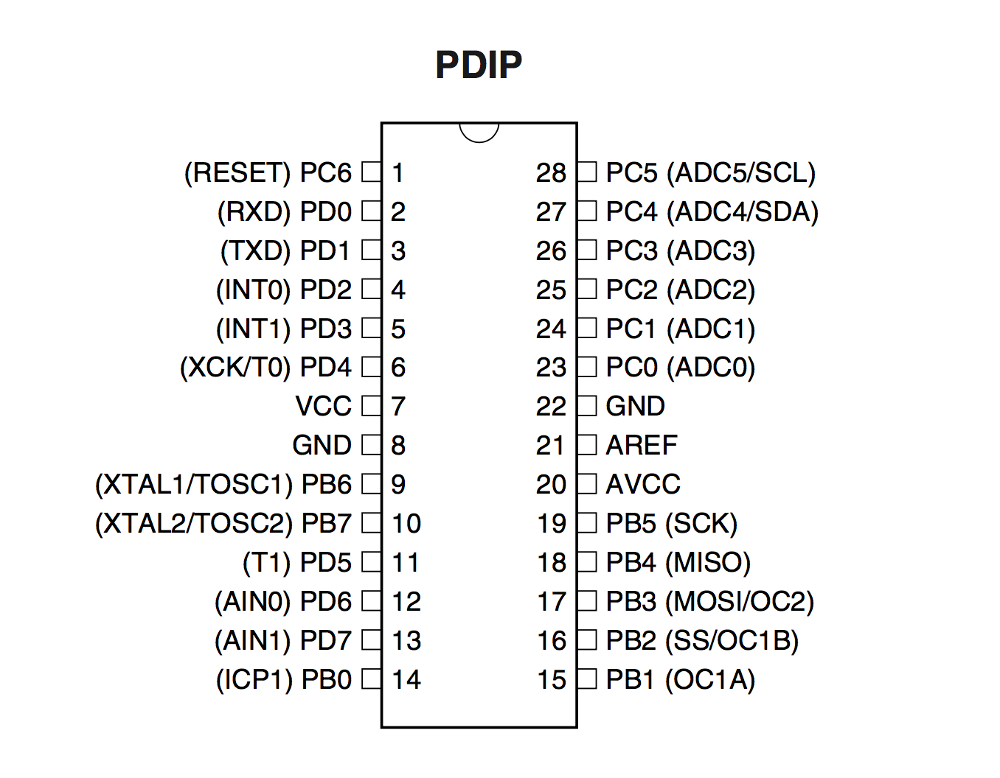

requirements
============
Overview
--------
* ATMega8 Pinout DIP package

	
* memory: data, program, eeprom

	- 8k Flash program
	- 1k SRAM data
	- 512bytes EEPROM

toolchain
---------
On a mac os system there is a complete development package called [gnu avr-gcc](https://www.obdev.at/products/crosspack/index.html), that includes all necessary tools:

* avrdude - programming software / uploader
* gas - assembler
* avr-gcc - compiler & linker

The *crosspack* package also contains [documentation](file:///usr/local/CrossPack-AVR/manual/index.html) on how to work with projects (incl. Makefile generation from template, project folder, etc.)

When programming in assembler it is a big adventage to access the microcontrollers resources, like GPIO and registers using predefined constants. For the ATmega8 those definitions can be included into the source from the file m8def.inc (find this file in the Atmel dossier resource folder):
	
	.include "m8def.inc"

hw
----
An eay way to program the ATmega8 is using the serial programming approach. Hardware programmer are cheap to get from ebay (around 1,50-3,50 €), and only a few connections have to be made. An In-Circuit-Programming is possible - if the dedicated SPI pins are available.

The programmer is controlled by the programming software - in this case: *avrdude* - via the USB port. It provides the following signals to the circuit: 5V (watch the maximum load a USB port can drive - it might be appropriate to use a separate power supply for the circuit instead), GND, MISO, MOSI, /RESET.

(image)

With an adapter cable having a programmer connector on one side, and wired pins on the other side, the programming adapter can be connected to the circuit on a breadboard. Be aware of the power supply, that mustn’t collide with the circuits own supply.

(image)

When testing ATMega programming procedure it might be useful to connect a LED for visual feedback.
  

* USB programmer (image, pin assignment)
* ISP adapter cable for breadboard (image, pin assignment)
* test circuit (might have a LED for testing)

procedure
=========
Fuses
-----
The ATMega8 (for example) can be driven by an external clock up to 16 MHz, or an internal RC oscillator with 1, 2, 4 or 8 MHz. The clock source must be set by programming the microcontrollers fuses, pretty much the same way, as one would do to program the flash program memory of the device - so the same programming equipment can be used together with a special avrdude option **-U**. Under the hood the fuse programming is realized with dedicated commands from the serial programming instruction set, as described in the ATMega datasheet (Table 24-16).
Basically, the fuses (for ATMega8) consist of two bytes:

	# Example for 8 MHz internal oscillator
	# Fuse high byte:
	# 0xd9 = 1 1 0 1   1 0 0 1 <-- BOOTRST (boot reset vector at 0x0000)
	#        ^ ^ ^ ^   ^ ^ ^------ BOOTSZ0
	#        | | | |   | +-------- BOOTSZ1
	#        | | | |   +---------- EESAVE (set to 0 to preserve EEPROM over chip erase)
	#        | | | +-------------- CKOPT (clock option, depends on oscillator type)
	#        | | +---------------- SPIEN (if set to 1, serial programming is disabled)
	#        | +------------------ WDTON (if set to 0, watchdog is always on)
	#        +-------------------- RSTDISBL (if set to 0, RESET pin is disabled)
	# Fuse low byte:
	# 0x24 = 0 0 1 0   0 1 0 0
	#        ^ ^ \ /   \--+--/
	#        | |  |       +------- CKSEL 3..0 (8M internal RC)
	#        | |  +--------------- SUT 1..0 (slowly rising power)
	#        | +------------------ BODEN (if 0, brown-out detector is enabled)
	#        +-------------------- BODLEVEL (if 0: 4V, if 1: 2.7V)
	#
	# For computing fuse byte values for other devices and options see
	# the fuse bit calculator at http://www.engbedded.com/fusecalc/

Programming the fuses  with an USBasp compatible programmer and the *avrdude* software would look like this:

	$ avrdude -P usb -c usbasp-clone -p ATmega8 -U lfuse:w:0xE1:m -U hfuse:w:0xd9:m
	[...]	
	avrdude done.  Thank you.

* assemble/compile/link sources
* deploy on microcontroller with avrdude

sample files
------------
* have a script for fast deployment
* blink assembler
* m8def.inc

